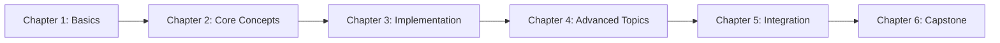

# Module Title

Welcome to **Module [Number]: [Module Name]**. This module focuses on [primary topic] and its role in building intelligent humanoid robots.

## Module Overview

[2-3 paragraphs providing a high-level introduction to the module's content, importance, and place in the overall textbook structure]

This module covers:
- Major topic 1
- Major topic 2
- Major topic 3
- Major topic 4

## Why This Matters

:::tip Real-World Impact

Understanding [module topic] is crucial because:

- **Reason 1:** Practical importance in robotics
- **Reason 2:** Foundation for advanced capabilities
- **Reason 3:** Industry-standard approach
- **Reason 4:** Enabler for autonomous systems

:::

## Module Structure

This module is organized into the following chapters:

### Part 1: [Section Name]

1. **[Chapter 1 Title](/docs/path/chapter1)** - What you'll learn
2. **[Chapter 2 Title](/docs/path/chapter2)** - Key concepts covered
3. **[Chapter 3 Title](/docs/path/chapter3)** - Practical skills developed

### Part 2: [Section Name]

4. **[Chapter 4 Title](/docs/path/chapter4)** - Advanced topics
5. **[Chapter 5 Title](/docs/path/chapter5)** - Integration strategies
6. **[Chapter 6 Title](/docs/path/chapter6)** - Real-world applications

## Learning Path

## Prerequisites

Before starting this module, you should have:

- **Prerequisite 1:** Required knowledge or skills
- **Prerequisite 2:** Previous modules completed (if applicable)
- **Prerequisite 3:** Tools or software installed

## Learning Outcomes

By completing this module, you will be able to:

1. **Outcome 1:** Specific, measurable skill or knowledge
2. **Outcome 2:** Practical capability you'll develop
3. **Outcome 3:** Conceptual understanding you'll gain
4. **Outcome 4:** Real-world problem you can solve
5. **Outcome 5:** Integration ability with other systems

## Module Project

Throughout this module, you'll work on: **[Project Name]**

**Project Goal:** Build/implement [specific system or capability]

**Key Features:**
- Feature 1: Description
- Feature 2: Description
- Feature 3: Description

**Technologies Used:**
- Technology 1
- Technology 2
- Technology 3

## Time Commitment

| Component | Estimated Time |
|-----------|----------------|
| Reading & Theory | X hours |
| Code Examples | Y hours |
| Exercises | Z hours |
| Module Project | W hours |
| **Total** | **Total hours** |

## Support Resources

### Documentation

- [Official Docs](URL) - Primary reference material
- [API Reference](URL) - Detailed API documentation

### Community

- **Discord/Forum:** Where to ask questions
- **GitHub:** Example code and projects

### Getting Help

If you get stuck:
1. Check the [Troubleshooting](/docs/appendix/troubleshooting) guide
2. Review the [Glossary](/docs/appendix/glossary) for terminology
3. Ask questions in the community forum

## Ready to Start?

Begin your journey with: **[First Chapter Title](/docs/path/first-chapter)**

---

*Module Duration: [X-Y hours] | Difficulty: [Beginner/Intermediate/Advanced]*
